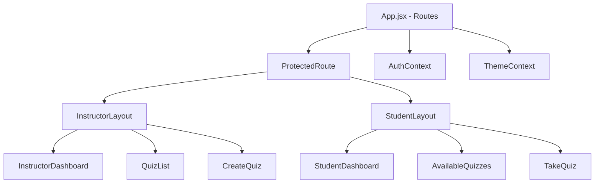

# Professional Engineering Report: Frontend Systems
## Project: Online Quizzing Application

---

## 1. FRONTEND OVERVIEW

### Focus
The frontend of the Online Quizzing Application is designed with a "Mobile-First" and "User-Centric" philosophy. It focuses on providing a high-fidelity, interactive environment that minimizes friction during high-stakes assessments.

### Key Objectives
- **Dynamic UX:** Real-time updates for timers and submission states.
- **Responsive Design:** Seamless experience across desktop, tablet, and mobile.
- **Secure Navigation:** Role-based routing to prevent unauthorized access.

### Technologies
- **Framework:** React 19 (Functional Components & Hooks)
- **State Management:** Context API (Auth & Theme)
- **Routing:** React Router DOM (v7)
- **Styling:** Tailwind CSS (Modern Utility-First Design)
- **Icons:** Lucide-React
- **Charts:** Recharts (For student performance analytics)

---

### Frontend Architecture Diagram


### 2.1 Project Structure
```text
frontend/
├── src/
│   ├── components/
│   │   ├── layout/      (Sidebar, Navbar, Protected Routes)
│   │   ├── shared/      (Buttons, Inputs, Cards)
│   ├── context/         (AuthContext, ThemeContext)
│   ├── pages/           (Standalone page views)
│   ├── services/        (Axios API instance and helpers)
│   ├── App.jsx          (Route definitions)
│   ├── main.jsx         (Client entry point)
```

### 2.2 UI Modules
#### Authentication Suite
- **Login/Signup:** clean forms with validation feedback and smooth transitions between roles.

#### Instructor Hub
- **Create Quiz:** A multi-step form logic allowing dynamic question addition.
- **Analytics:** Data visualization using Recharts to show successful attempts and score distributions.

#### Student Experience
- **Available Quizzes:** A card-based grid showing all current assessments.
- **Take Quiz:** A focused interface with a real-time countdown timer syncronized with the backend.

---

## 3. CORE IMPLEMENTATION DETAILS

### 3.1 API Integration
The frontend communicates with the backend via a centralized Axios instance.
- **Base URL:** Configurable via environment variables.
- **Interceptors:** Automatically attaching JWT tokens to headers for protected routes.
- **Error Handling:** Global toast notifications or error cards for failed requests.

### 3.2 Timer & Session Management
- **Implementation:** Custom React `useEffect` hook managing a countdown state.
- **Auto-Submit:** Logic triggered when the timer reaches zero, ensuring the student's current progress is captured even without a manual click.
- **Resilience:** Local state persistence to prevent data loss on accidental page refreshes.

### 3.3 Protected Routing
- **HOC Pattern:** A `ProtectedRoute` component wraps sensitive routes.
- **Role Verification:** Logic checks `AuthContext` to ensure a "Student" cannot access "Instructor" dashboards, redirecting them appropriately.

---

## 4. GIT VERSION CONTROL WORKFLOW

### 4.1 Branching Strategy
The project utilised a feature-based branching strategy hosted on [GitHub](https://github.com/ksbhanuteja-dot/quiz_online.git):
- **`feat/frontend`:** Focused on the React application, styling, and integration.
- **`feat/backend`:** Focused on API endpoints and PostgreSQL integration.

### 4.2 Commit History Highlights
| Commit Type | Purpose | Example |
|---|---|---|
| `feat` | New functionality | `feat: Implement initial frontend setup including Instructor` |
| `release`| Versioning | `Final release: Full Stack Online Quizzing Application` |
| `fix`   | Bug resolution | `fix: resolve timer sync issues` |

---

## 5. INTEGRATION & FINAL FEATURES

### Integration Process
- **CORS Handling:** Configured FastAPI to allow requests from the Vite development port (5173).
- **Token Persistence:** Storing JWT in `localStorage` for session continuity.

### Final Application Features
- **Role-Based Portals:** Completely separate UX for Students and Instructors.
- **Dynamic Assessments:** Instant creation and attempt flow.
- **Interactive Leaderboards:** Real-time ranking based on aggregate scores.
- **Score Analytics:** Visual performance tracking for students.

---

## 6. CONCLUSION

The Online Quizzing Application represents a comprehensive full-stack solution. By leveraging **FastAPI's speed** and **React's interactivity**, we have built a platform that is scalable, secure, and visually premium. This project demonstrates best practices in API design, database normalization, and modern frontend architecture.
